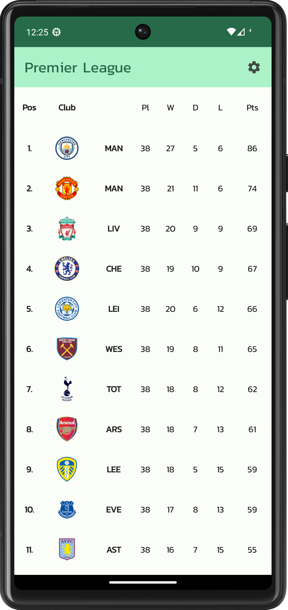
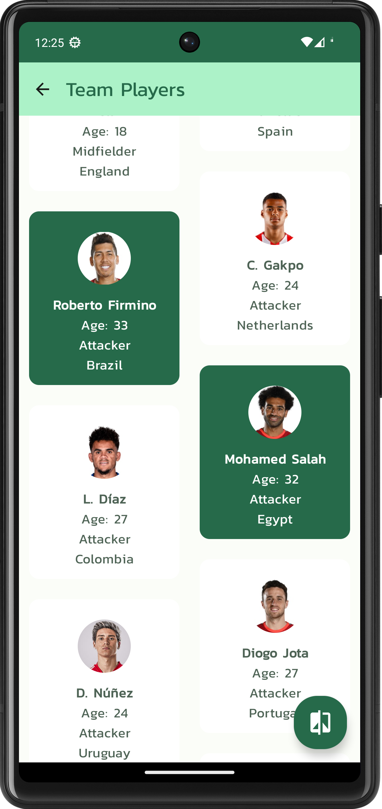

# Android application for showing Premier League statistics

This repository serves as Android project architecture showcase.

Repository is based on the official Android Github Browser Sample with Android Architecture Components:
https://github.com/android/architecture-components-samples/tree/master/GithubBrowserSample

### Libraries
* [Android Support Library][support-lib]
* [Android Architecture Components][arch]
* [Android Data Binding][data-binding]
* [Dagger 2][dagger2] for dependency injection
* [Retrofit][retrofit] for REST api communication
* [Glide][glide] for image loading

[support-lib]: https://developer.android.com/topic/libraries/support-library/index.html
[arch]: https://developer.android.com/arch
[data-binding]: https://developer.android.com/topic/libraries/data-binding/index.html
[dagger2]: https://google.github.io/dagger
[retrofit]: http://square.github.io/retrofit
[glide]: https://github.com/bumptech/glide

License
--------

Copyright 2017 The Android Open Source Project, Inc.

Licensed to the Apache Software Foundation (ASF) under one or more contributor
license agreements.  See the NOTICE file distributed with this work for
additional information regarding copyright ownership.  The ASF licenses this
file to you under the Apache License, Version 2.0 (the "License"); you may not
use this file except in compliance with the License.  You may obtain a copy of
the License at

http://www.apache.org/licenses/LICENSE-2.0

Unless required by applicable law or agreed to in writing, software
distributed under the License is distributed on an "AS IS" BASIS, WITHOUT
WARRANTIES OR CONDITIONS OF ANY KIND, either express or implied.  See the
License for the specific language governing permissions and limitations under
the License.
