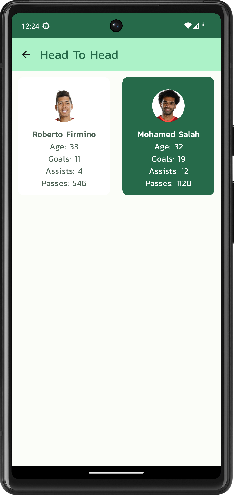

# Android application for showing Premier League statistics

This repository serves as Android project architecture showcase.

Repository was initially based on the official Android Github Browser Sample with Android Architecture Components:
https://github.com/android/architecture-components-samples/tree/master/GithubBrowserSample and it is updated to use latest tech stack in Android ecosystem.

### Libraries
* [Android Architecture Components][arch]
* [MVVM architectural pattern][mvvm]
* [Dependency injection with Hilt][hilt]
* [Jetpack Compose UI][compose]
* [Material Design 3][material3]
* [Downloadable Fonts][fonts]
* [Retrofit][retrofit] for REST API communication
* [Coil][coil] for image loading

[arch]: https://developer.android.com/arch
[mvvm]: https://developer.android.com/topic/libraries/architecture/viewmodel
[hilt]: https://developer.android.com/training/dependency-injection/hilt-android
[compose]: https://developer.android.com/jetpack/compose
[material3]: https://m3.material.io/develop/android/mdc-android
[fonts]: https://developer.android.com/develop/ui/views/text-and-emoji/downloadable-fonts
[retrofit]: http://square.github.io/retrofit
[coil]: https://coil-kt.github.io/coil/compose

License
--------

Copyright 2017 The Android Open Source Project, Inc.

Licensed to the Apache Software Foundation (ASF) under one or more contributor
license agreements.  See the NOTICE file distributed with this work for
additional information regarding copyright ownership.  The ASF licenses this
file to you under the Apache License, Version 2.0 (the "License"); you may not
use this file except in compliance with the License.  You may obtain a copy of
the License at

http://www.apache.org/licenses/LICENSE-2.0

Unless required by applicable law or agreed to in writing, software
distributed under the License is distributed on an "AS IS" BASIS, WITHOUT
WARRANTIES OR CONDITIONS OF ANY KIND, either express or implied.  See the
License for the specific language governing permissions and limitations under
the License.
